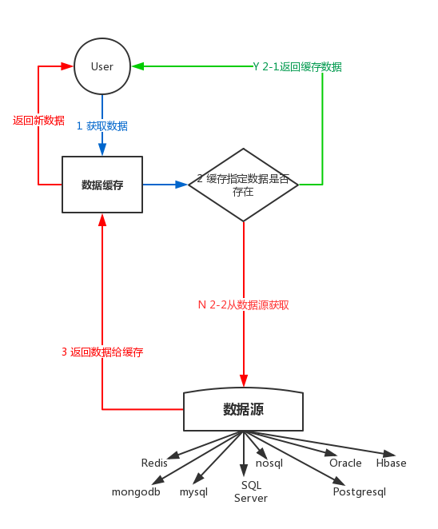
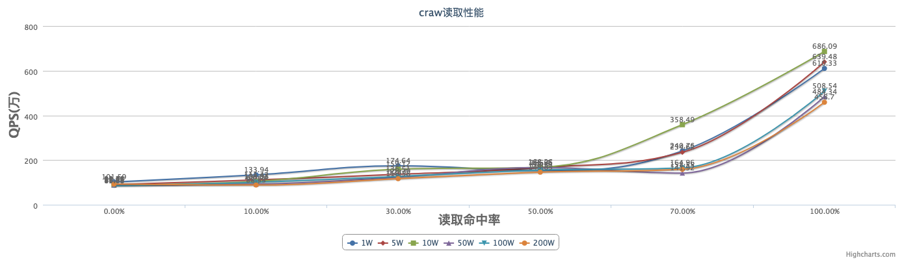
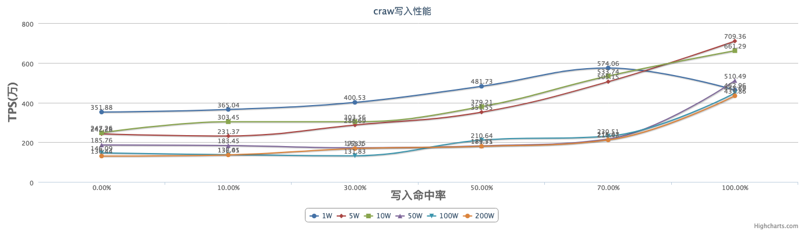
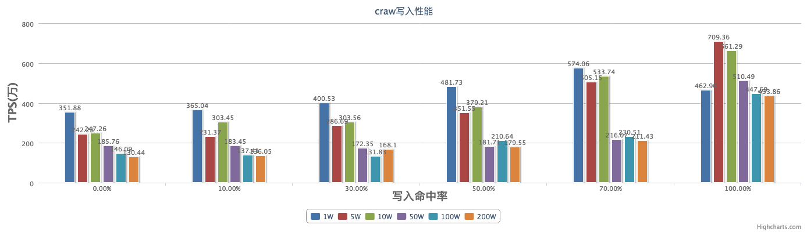

# craw

- 数据缓存包

## 1. 功能

实现了数据的二级缓存，使用K-V结构存储，用于缓存网络访问后的数据以便于二次访问，可用于redis，mysql等数据的二级缓存:

<div align=center>

</div>


## 2. 使用

```go
	import (
		"github.com/wonderivan/craw"
	)
	
	// 使用者需要实现自定义的CrawInterface包含的四个方法才可以进行craw初始化
	type benchCraw struct {
	}
	
	func (this *benchCraw) Init() error {
		// 创建缓存时，在创建完成后会执行用户自定义的初始化函数，如果不需要初始化其他项，可以直接返回nil
		return nil
	}
	
	func (this *benchCraw) CustomGet(key string) (data interface{}, expired time.Duration, err error) {
		// 当调用craw获取远端数据时,内部会调用该方式实现,用户需要指定缓存数据过期时间，0为马上过期
		return key, -1, nil
	}
	
	func (this *benchCraw) CustomSet(key string, data interface{}) error {
		// 当调用craw设置远端数据时,内部会调用该方式实现，不需要设置，可以直接返回nil
		return nil
	}
	
	func (this *benchCraw) Destroy() {
		// 销毁缓存时，会执行用户自定义的销毁方法，如果不需要销毁其他项，该方法可以为空
	}

	
	// 创建缓存，使用默认配置
	craw := NewCraw("mytest1", new(benchCraw))
	// 使用完后销毁缓存
	defer craw.Destroy()
	
	// 设置缓存数据 key:"name",value:"Lily", 过期时间-1，不过期
	handler.SetCraw("name","Lily", -1)
	
	// 获取缓存数据
	handler.GetData("name")
	
	// 获取缓存数据命中率
	handler.HitRate()
	
```	

## 3. 方法列表
```go
// 创建一个craw
// 参数 crawName:缓存名称，config缓存配置， dispose缓存数据处理方法
func NewCraw(crawName string, dispose CrawInterface, config ...string) *Craw

// config格式
{
	"low": 858993459, 	// 缓存压缩最低阈值限制，默认为800 MB
	"high": 1073741824, // 缓存触发清理最高阈值，默认为1 GB，当缓存数据大于1G时，开始清理，详见LruCache说明
	"interval": 3600    // 缓存有效数据检查间隔，默认为1天
}

// 销毁craw
func (dc *Craw) Destroy() 

// 获取缓存数据，如果不存在则从远端获取数据并更新到craw然后返回
//
// 参数 key:要查找的craw数据的key
// 返回值 interface{}:找到的数据  error:成功为nil
func (dc *Craw) GetData(key string) (interface{}, error)

// 强制从远端获取数据，并更新到craw
//
// 参数 key:要查找的远端数据的key
// 返回值 interface{}:更新到craw的数据
// 返回值 成功为nil
func (dc *Craw) UpdateData(key string) (data interface{}, err error) 

// 删除craw缓存数据
//
// 参数 key:要查找的远端数据的key
// 参数可选 delay:延迟删除数据的时间 单位(s)
// 返回值 成功为nil
func (dc *Craw) DeleteData(key string, delay ...time.Duration) (err error)

// 保存数据到远端，并删除craw中已有的缓存值
//
// 参数 key:要保存到远端的数据的key  data:要保存到远端的数据
// 返回值 error:成功为nil
func (dc *Craw) SetData(key string, data interface{}) (err error)

// 清空craw的所有数据
func (dc *Craw) ClearAll() error

// 清除craw中所有包含前缀prefix的key的数据
func (dc *Craw) ClearPrefixKeys(Prefix string) error

// 获取当前craw缓存命中率
//
// 返回值 float64:计算的结果，XX.XXXXX%
func (dc *Craw) HitRate()

// 获取当前craw缓存命中率并重置命中率为0
//
// 返回值 float64:计算的结果，XX.XXXXX%
func (dc *Craw) ResetHitRate() float64

// 设置craw缓存数据，不更新远端
//
// 参数 key:要保存的数据的key  data:要保存的数据,expired要保存的数据的过期时间，<0不过期
// 返回值 error:成功为nil
func (dc *Craw) SetCraw(key string, data interface{}, expired time.Duration) error

// 查询craw中指定的key是否存在
func (dc *Craw) IsExist(key string) (bool, error)
```

## 4. 性能测试

针对当前设计的二级缓存进行精简的K-V读写压力测试
测试分为1W，5W,10W,50W,100W,200W，
分别设置命中率为0%,10%,30%,50%,70%,100%进行读写测试，
然后统计总用时，每条读写耗时，每秒读写条数

### 4.1 性能图示

<div align=center>
读取缓存性能测试曲线图

</div>

<div align=center>
写入缓存性能测试曲线图

</div>

<div align=center>
读取缓存性能测试柱状图

</div>

<div align=center>
写入缓存性能测试柱状图

</div>

### 4.2 实测数据

测试量|读取命中率|总用时|每条读取耗时|每秒读取条数
|-|-|-|-|-|
|10000|0.00%|8.681537ms|868.15ns/op|1151869.77op|
|10000|10.00%|6.025206ms|602.52ns/op|1659694.29op|
|10000|30.00%|5.374784ms|537.48ns/op|1860539.88op|
|10000|50.00%|3.643583ms|364.36ns/op|2744551.17op|
|10000|70.00%|2.648619ms|264.86ns/op|3775552.47op|
|10000|100.00%|1.210079ms|121.01ns/op|8263923.26op|
|50000|0.00%|45.364929ms|907.30ns/op|1102173.00op|
|50000|10.00%|38.790983ms|775.82ns/op|1288959.34op|
|50000|30.00%|29.191049ms|583.82ns/op|1712853.83op|
|50000|50.00%|24.245481ms|484.91ns/op|2062239.97op|
|50000|70.00%|13.359667ms|267.19ns/op|3742608.26op|
|50000|100.00%|6.47295ms|129.46ns/op|7724453.30op|
|100000|0.00%|96.2213ms|962.21ns/op|1039270.93op|
|100000|10.00%|81.877599ms|818.78ns/op|1221335.28op|
|100000|30.00%|68.601832ms|686.02ns/op|1457687.02op|
|100000|50.00%|52.831959ms|528.32ns/op|1892793.72op|
|100000|70.00%|28.859204ms|288.59ns/op|3465099.04op|
|100000|100.00%|14.512613ms|145.13ns/op|6890557.89op|
|500000|0.00%|580.435456ms|1160.87ns/op|861422.22op|
|500000|10.00%|550.468097ms|1100.94ns/op|908317.85op|
|500000|30.00%|419.168104ms|838.34ns/op|1192838.85op|
|500000|50.00%|312.806598ms|625.61ns/op|1598431.76op|
|500000|70.00%|259.572573ms|519.15ns/op|1926243.57op|
|500000|100.00%|89.384522ms|178.77ns/op|5593809.63op|
|1000000|0.00%|1.163256084s|1163.26ns/op|859655.94op|
|1000000|10.00%|1.070822941s|1070.82ns/op|933861.20op|
|1000000|30.00%|851.79008ms|851.79ns/op|1173998.18op|
|1000000|50.00%|647.7622ms|647.76ns/op|1543776.40op|
|1000000|70.00%|578.194375ms|578.19ns/op|1729522.19op|
|1000000|100.00%|195.846202ms|195.85ns/op|5106047.45op|
|2000000|0.00%|2.290312946s|1145.16ns/op|873243.11op|
|2000000|10.00%|2.440874727s|1220.44ns/op|819378.39op|
|2000000|30.00%|1.938333138s|969.17ns/op|1031814.38op|
|2000000|50.00%|1.50874304s|754.37ns/op|1325606.78op|
|2000000|70.00%|1.248193013s|624.10ns/op|1602316.29op|
|2000000|100.00%|424.174077ms|212.09ns/op|4715045.33op|

测试量|写入命中率|总用时|每条写入耗时|每秒写入条数
|-|-|-|-|-|
|10000|0.00%|2.84051ms|284.05ns/op|3520494.56op|
|10000|10.00%|2.72975ms|272.98ns/op|3663339.13op|
|10000|30.00%|2.409758ms|240.98ns/op|4149794.29op|
|10000|50.00%|2.157198ms|215.72ns/op|4635643.09op|
|10000|70.00%|1.676161ms|167.62ns/op|5966014.00op|
|10000|100.00%|1.272334ms|127.23ns/op|7859571.46op|
|50000|0.00%|19.780616ms|395.61ns/op|2527727.14op|
|50000|10.00%|21.111112ms|422.22ns/op|2368420.95op|
|50000|30.00%|18.702363ms|374.05ns/op|2673458.96op|
|50000|50.00%|15.233516ms|304.67ns/op|3282236.35op|
|50000|70.00%|10.959622ms|219.19ns/op|4562201.14op|
|50000|100.00%|8.132663ms|162.65ns/op|6148047.69op|
|100000|0.00%|40.368559ms|403.69ns/op|2477175.37op|
|100000|10.00%|41.886854ms|418.87ns/op|2387383.88op|
|100000|30.00%|39.782839ms|397.83ns/op|2513646.65op|
|100000|50.00%|39.339891ms|393.40ns/op|2541949.09op|
|100000|70.00%|36.249307ms|362.49ns/op|2758673.43op|
|100000|100.00%|16.909974ms|169.10ns/op|5913669.65op|
|500000|0.00%|290.534367ms|581.07ns/op|1720966.80op|
|500000|10.00%|294.119801ms|588.24ns/op|1699987.55op|
|500000|30.00%|301.406549ms|602.81ns/op|1658888.97op|
|500000|50.00%|240.751022ms|481.50ns/op|2076834.38op|
|500000|70.00%|232.707867ms|465.42ns/op|2148616.66op|
|500000|100.00%|103.425529ms|206.85ns/op|4834396.35op|
|1000000|0.00%|751.04895ms|751.05ns/op|1331471.14op|
|1000000|10.00%|763.607503ms|763.61ns/op|1309573.30op|
|1000000|30.00%|706.018802ms|706.02ns/op|1416392.87op|
|1000000|50.00%|466.665309ms|466.67ns/op|2142863.38op|
|1000000|70.00%|494.240314ms|494.24ns/op|2023307.23op|
|1000000|100.00%|215.737465ms|215.74ns/op|4635263.51op|
|2000000|0.00%|1.378425505s|689.21ns/op|1450930.78op|
|2000000|10.00%|1.321529037s|660.76ns/op|1513398.45op|
|2000000|30.00%|1.314644183s|657.32ns/op|1521324.19op|
|2000000|50.00%|882.820403ms|441.41ns/op|2265466.45op|
|2000000|70.00%|1.010007853s|505.00ns/op|1980182.62op|
|2000000|100.00%|468.810806ms|234.41ns/op|4266113.27op|
